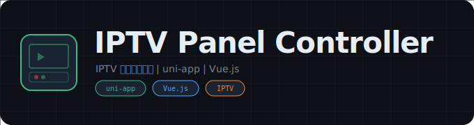

  

  # IPTV Panel Controller

  **IPTV 推流控制面板前后端系统**

  
  

---

## 概述

基于 uni-app 框架的 IPTV 推流控制面板，前后端分离架构，支持多端适配。提供直播流管理、频道控制、推流状态监控等功能。

## 功能特性

- **推流管理** -- 直播流的启动、停止、状态监控
- **频道控制** -- IPTV 频道的增删改查
- **多端适配** -- 基于 uni-app 支持 H5、小程序、App
- **前后端分离** -- RESTful API 架构

## 技术栈

- **前端**: uni-app + Vue.js
- **后端**: Node.js / Python
- **协议**: RTMP / HLS

## 免责声明

本项目仅供学习研究使用。